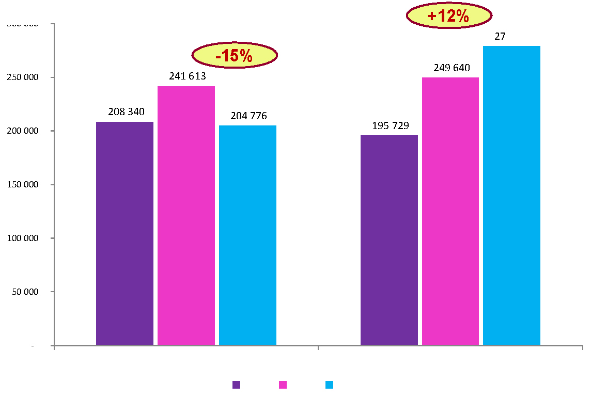
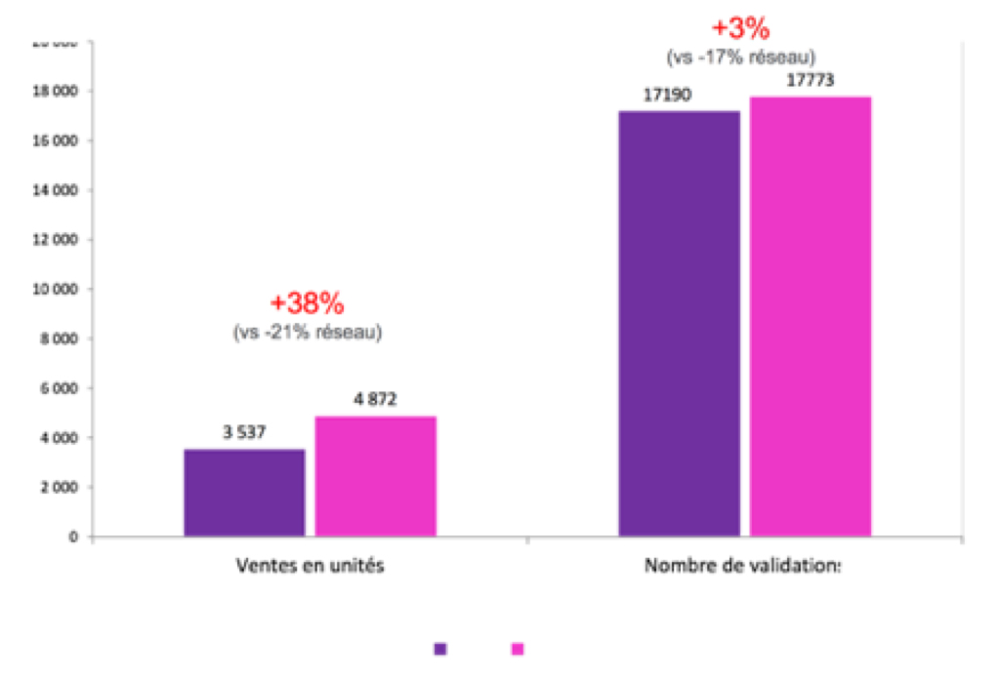
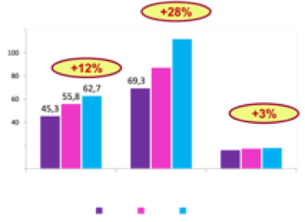

LE POINT SUR… 
# L’ÉVOLUTION DES MOBILITÉS EN GARE DE CDG1 AU COURS DU PREMIER MOIS DE MISE EN PLACE DU NAVIGO TOUTES ZONES

Les deux gares de l’aéroport de Roissy Charles de Gaulle (CDG1 et CDG2) sont des gares très spécifiques au sein du réseau SNCF en Ile-de-France. traversées par une clientèle occasionnelle, elles représentent le point de vente le plus important pour les tickets Paris-Visite. L’entrée en vigueur, en septembre 2015, du _Navigo Toutes Zones_ ainsi que la campagne promotionnelle qui l’a accompagnée fut l’occasion d’observer de plus près l’évolution des comportements de mobilité des usagers de la gare CDG1 et d’en comprendre les facteurs de changements. 

## UNE ANALYSE MENÉE AU PRISME DES DONNÉES DE VALIDATION
SNCF Transilien dispose d’une multitude d’outils pour estimer le plus précisément possible les flux sur l’ensemble des gares du territoire francilien : enquêtes de terrain, traces GSM, comptages automatiques ou manuels, mais aussi capteurs innovants tels que les caméras thermiques ou tapis de comptage, etc. Mais l’ par SNCF Transilien repose aujourd’hui sur les données de validation, correspondant aux informations recueillies lorsqu’un voyageur valide son titre de transport. Cet acte de validation renseigne notamment sur le type de titre possédé, le tarif associé ainsi que l’horaire de passage. Contrairement à l’idée que l’on pourrait s’en faire, il est impossible de collecter des informations personnelles concernant les voyageurs munis, par exemple, de passe Navigo, les numéros de cartes étant anonymysés et leur identifiant modifié tous les  mois. 

Deux catégories de titres de transport permettant de recueillir des données de validation, sont en usage sur le réseau Transilien : 

- Les tickets (ex : T+, Origine-Destination, Mobilis, Paris-Visite, etc.), issus d’une technologie dite “magnétique”. 

- Les titres “télébillétques” Navigo qui se déclinent en plusieurs types de forfaits liés à la durée de l’engagement (Mois, Semaine, Annuel, etc.) ou à la catégorie du voyageur (Imagine’R, Améthyste, Solidarité, etc.)

## UNE CLIENTÈLE OCCASIONNELLE QUI S’EST LAISSÉE SÉDUIRE PAR LES NOUVEAUX AVANTAGES DU NAVIGO SEMAINE
Alors que les validations magnétiques (tous tickets) ne représentaient en 2014 que 16% de l’ensemble des validations du réseau SNCF en Ile-de-France, elles en constituaient pourtant 51% dans la seule gare de CDG1. Ce phénomène s’expliquait assez aisément à l’époque, la clientèle occasionnelle en transit n’ayant aucun intérêt à opter pour un forfait. 

Le nombre de validations de cette catégorie de titres de transport a néanmoins chuté de 15% entre septembre 2014 et septembre 2015, soit une baisse similaire à ce que l’on a pu observer sur le reste du réseau. En revanche, et c’est là où cette gare se distingue, les validations télébillétiques (tous forfaits Navigo) s’y sont faites plus nombreuses (+12%, soit 30 000 passages de plus sur la période retenue). Au-delà des conclusions que l’on peut tirer de cette augmentation des validations, on note également que les ventes en unités du forfait Navigo Semaine ont augmenté de 34% à CDG1, à l’inverse des autres gares Transiliennes qui les ont vu chuter de 20% en septembre 2014. 

Ainsi, là où les voyageurs réguliers ont adopté le _Navigo Toutes Zones_ à 70 euros par mois, beaucoup de clients occasionnels de CDG1 ont découvert les avantages du forfait Navigo Semaine. Celui-ci étant dorénavant à peine plus cher qu’un seul _ticket aller-retour CDG1-Paris_, et le titre _Paris-Visite zones 1-5_ coûtant 23,50 euros pour 1 jour, le Navigo Semaine vient donc concurrencer les offres existantes. Cette tendance au report des voyageurs vers le forfait hebdomaire, essentiellement sur carte _Navigo Découverte_, se confirme d’ailleurs par une chute d’environ 30% des ventes et validations de tickets _Paris-Visite_ en gare de CDG1. 

Rappelons néanmoins que même si la part des titres télébillétiques est en augmentation dans cette gare, la vente de tickets y diminue pourtant moins vite qu’ailleurs sur le réseau Ile-de-France. En septembre 2015, les billets _Origine-Destination_ représentaient encore un peu moins des deux tiers du chiffre d’affaires de CDG1. Cela s’explique sûrement par le nombre important de voyageurs très occasionnels, non franciliens, qui n’avaient pas encore eu connaissance des avantages du _Navigo Toutes Zones_. 

 

## UNE HAUSSE SURPRENANTE DES VALIDATIONS DE FORFAITS NAVIGO MOIS
Comme nous l’avons vu, la typologie de clientèle très propre à cette gare aurait pu faire penser que seul le _Navigo Semaine_ connaîtrait une forte évolution, mais ce sont pourtant les validations de forfaits mensuels qui enregistrent la hausse la plus marquée (+ 28% pour le _Navigo Mois_). Il en est d’ailleurs de même des ventes de ce titre, qui progressent beaucoup plus à CDG1 (+45% en unités) que sur l’ensemble du réseau (+13%). 

Quelques pistes d’explication s’offrent à nous : 

- On peut envisager que ce sont davantage les franciliens qui disposaient déjà d’un _Navigo Mois_ sur un zonage plus petit qui l’utilisent aujourd’hui jusqu’à CDG1. Ce qui serait cohérent avec la quasi disparition des ventes de _compléments de parcours_ que l’on observait dans cette gare.

- La mise en œuvre au 7 septembre 2015, au lieu du 1er septembre de la nouvelle tarification unique pour les forfaits hebdomadaires, aurait pu entraîner un report de certains habitués du _Navigo Semaine_ vers le _Navigo Mois_.

## ALORS… PLUS D’ABONNÉS OU PLUS DE MOBILITÉ EN GARE DE CDG1 ?

Dans cette gare, les résultats du mois de septembre 2015 montrent que c’est le nombre d’abonnés, et non le nombre de déplacements, qui a crû : 

- 67% d’abonnements en plus pour le Navigo Annuel,
- + 95% pour le Navigo Mois,
- + 64% pour le Navigo Semaine.

 

On peut aisément imaginer que la récente attractivité du forfait fut pour beaucoup dans cette augmentation du nombre d’abonnés. Pour les voyageurs, l’investissement serait devenu plus intéressant même s’ils ne se rendent qu’occasionnellement dans cette gare. Quelques chiffres tendent à soutenir cette hypothèse : 

- Au cours du mois de septembre 2014, les détenteurs de forfaits Navigo qui transitaient régulièrement par la gare CDG1 y avaient, en moyenne, validé 25 fois leur titre de transports.
- En septembre 2015, on n’enregistrait plus que 20 validations par abonné.

----------------------------------------------------------------------------------------------------

### 	DES DÉZONAGES PLUS IMPORTANTS QUE L’ANNÉE PRÉCÉDENTE**

Une meilleure connaissance des dézonages est dorénavant possible grâce à l’analyse des données de validations des clients annuels passés automatiquement au forfait toutes zones, les anciens zonages étant toujours inscrits dans la carte. 

En septembre, ce sont près de 3000 abonnés annuels zones 1-2 de plus que l’année dernière qui ont transité par la gare CDG1. Ces derniers ont tendance à s’y rendre un peu plus les vendredis que tous les autres jours de la semaine. A cela s’ajoute environ 2000 abonnés zones 1-3, un peu plus de 1000 zones 1-4 et 700 zones 1-5 de plus qu’en septembre 2014.

----------------------------------------------------------------------------------------------------
