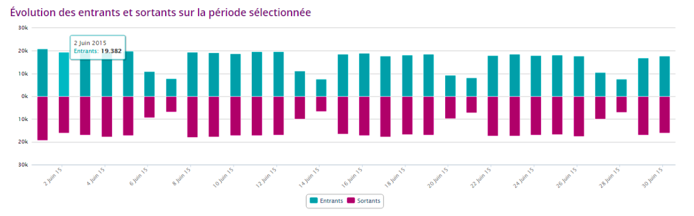
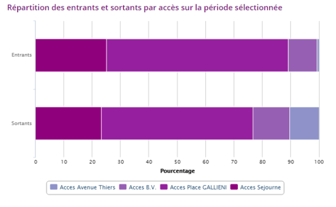

L’EXPÉRIMENTATION
## QUE NOUS APPRENNENT LES NOUVEAUX CAPTEURS WIFI DE LA GARE DE MELUN ?

Du 1er au 30 juin 2015, la gare de Melun a été équipée de deux solutions de comptage. La première consiste en une série de capteurs permettant d’enregistrer les signaux émis par tout système dont la connexion WIFI est activée (smartphones, tablettes, etc.). La pose ainsi que la collecte anonymisée de ces données ont été réalisées en partenariat avec la startup Smart Flows. Un second dispositif de capteurs vidéo 3D, comptant le nombre de passages par accès et développé par Quantaflow, a été installé au niveau de chacune des quatre entrées de la gare. 

## DIFFÉRENTES SOURCES DE COMPTAGE POUR DIFFÉRENTS USAGES

Le déploiement de capteurs innovants vient approfondir la compréhension des habitudes de déplacement des franciliens, en complément d’autres instruments de mesure des flux que sont, à titre d’exemple, les validations de titres de transport. Ces différents outils ne dispensent d’ailleurs pas tous le même type d’information. Là où les données de validation et celles issues des capteurs innovants permettent de mesurer l’affluence en gare en recensant tous les individus _entrants_ et _sortants_ aux accès, les opérations régulières de comptages manuels et les rames compteuses permettent d’estimer une charge moyenne des trains en enregistrant l’ensemble des usagers _montants_ et _descendants_des véhicules. L’indicateur observé dans l’analyse qui suit est le nombre d’_entrants_ et _sortants_ par tranche horaire de 15 minutes sur chacun des quatre accès de la gare. 

## PLACE GALLIENI, L’ACCÈS LE PLUS EMPRUNTÉ DE TOUS

En semaine, près de 20 000 voyageurs se croisent chaque jour en gare de Melun. 65% d’entre-eux empruntent l’entrée située Place Gallieni pour se rendre sur les quais, 25% y accèdent par l’entrée Séjourné et 10% par le Bâtiment Voyageur. Bien qu’étant uniquement accessible en sortie, les capteurs installés Avenue Thiers y ont toutefois détectés quelques _entrants_. Au cours du mois observé, les différents accès ont, à quelques disparités près, été empruntés de la même manière. 

## UNE FRAUDE PLUS ACCRUE SUR CERTAINS ACCÈS

Une analyse comparée entre les validations totales de titres de transport enregistrées aux bornes d’accès et le nombre d’usagers détectés par les capteurs permet d’estimer le taux de fraude en gare de Melun. Le graphique ci-dessous se focalise sur la journée du 1er juin mais le décalage entre validations et comptages innovants reste la même sur l’ensemble du mois, la fraude étant plus importante en sortie de gare. 

## DES DÉPLACEMENTS MAJORITAIREMENT PENDULAIRES

Ces nouveaux outils de mesure nous renseignent plus précisément sur la mobilité des voyageurs dits « pendulaires », soit tous ceux qui fréquentent les gares SNCF Transilien pour y prendre le train au moins deux fois dans la même journée et ce, à minima trois jours par semaine. 

Au cours des semaines du 8 juin et du 7 septembre 2015, 70% des voyageurs qui ont emprunté la gare de Melun ont effectué des trajets pendulaires :

- Au quotidien, 60% de ces usagers ont été détectés une première fois en gare entre 6h et 9h du matin. Plus d’un tiers d’entre eux réapparaissent une seconde fois entre 18h et 21h. 

- Pour 57% des voyageurs qui fréquentent régulièrement la gare de Melun, le temps séparant leurs deux passages correspond approximativement à une journée de travail (entre neuf et douze heures.)

## AFFAIRE À SUIVRE...

Les capteurs installés en gare de Melun n’ont pas toujours bénéficié de conditions optimales pour assurer une exacte précision des comptages (luminosité très faible sur certains des accès, fuite de flux pour cause de portail défectueux, etc.) Toutefois, l’exploration de ces nouveaux outils de mesure a été riche d’enseignements : d’un point de vue technologique d’une part, et sur l’usage des données collectées d’autre part. Cette première expérimentation s’étant avérée concluante, il est fort à parier que SNCF Transilien investira très prochainement dans ces technologies innovantes.
