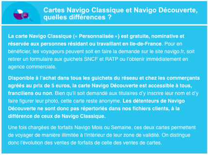
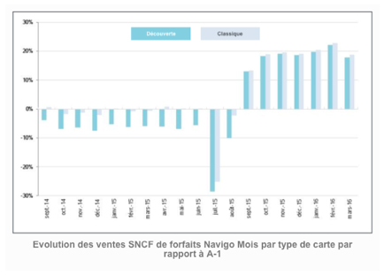
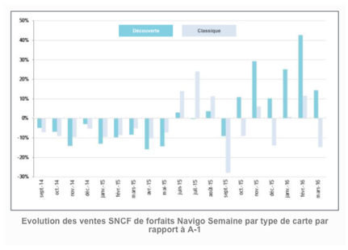
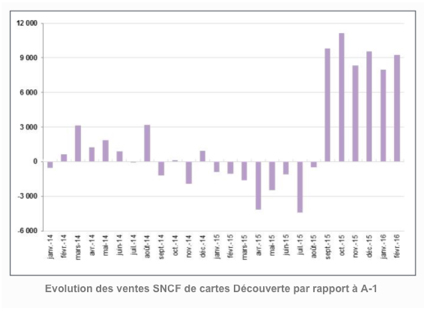

# LES FORFAITS NAVIGO ET LES CARTES DÉCOUVERTE FONT DE PLUS EN PLUS D'ADEPTES SUR LE RÉSEAU TRANSILIEN

### DES VENTES DE FORFAITS NAVIGO MOIS ET SEMAINE EN FORTE HAUSSE DEPUIS LA RENTRÉE 2015

Les ventes unitaires de forfaits Navigo Mois et Semaine réalisées sur automates ou guichets SNCF sont, depuis l’entrée en vigueur du Navigo Toutes Zones au 1er septembre 2015, en forte croissance. Cette tendance rompt la baisse régulière observée depuis début 2014. Les ventes de cartes Découvertes évoluent de la même façon.

**L’ensemble du réseau Transilien est concerné par cette hausse mais elle demeure particulièrement significative sur la ligne B** où l’on dénombre, entre octobre 2015 et mars 2016, 64% de ventes supplémentaires de forfaits hebdomadaires et mensuels. Sur cette même période, des records ont été enregistrés en gares de Roissy-CDG-2 (+88%) et CDG1 (+100%).

**S’agissant plus précisément des ventes de forfaits Navigo Mois, leur évolution a immédiatement suivi la mise en place de la nouvelle tarification. Elle est dès lors restée importante (+20% par rapport au même mois de l’année précédente) et régulière**, quelle que soit la carte Navigo (Classique ou Découverte) avec laquelle l’achat a été effectué.

**DES DÉTENTEURS DE CARTE DÉCOUVERTE PARTICULIÈREMENT FRIANDS DE FORFAITS HEBDOMADAIRES**

Contrairement au forfait mensuel, il aura fallu attendre la fin du mois de septembre pour que les ventes de Navigo Semaine prennent leur essor. Elles restent fortement tributaires des vacances scolaires et proviennent surtout de titulaires de cartes Découverte. **Entre octobre 2015 et mars 2016, les ventes de Navigo Semaine réalisées auprès de cette clientèle ont, en moyenne, progressé de 21% par rapport à la même période l’année précédente** (l’augmentation se situe, selon les mois, entre +10% et +43%) alors qu’elles ont diminué de 4% chez les utilisateurs de carte Navigo Classique.

**L’ensemble du réseau Transilien est concerné par cette hausse mais elle demeure particulièrement significative sur la ligne B où l’on dénombre, entre octobre 2015 et mars 2016, 64% de ventes supplémentaires de forfaits hebdomadaires. Sur cette même période, des records ont été enregistrés en gares de Roissy-CDG-2 (+88%) et CDG1 (+100%).

**L’ESSOR DES VENTES DE CARTES DÉCOUVERTE TEND À CONFIRMER L’HYPOTHÈSE SELON LAQUELLE LES VOYAGEURS SE SONT MASSIVEMENT BIEN ADAPTÉS AUX RÉCENTES ÉVOLUTIONS TARIFAIRES**

**L'analyse des évolutions de la mobilité en Ile-de-France nécessitant le croisement et le traitement de grandes quantités de données, il est encore trop tôt pour cerner parfaitement l’ensemble des mécanismes à l’oeuvre**. Dans ce cas précis, nous faisons face à plusieurs obstacles : 

- Les données de validation collectées aux bornes d’entrée ou de sortie des gares ne permettent pas de distinguer les cartes Découvertes des cartes Classiques.
- Les rechargements de forfaits effectués sur cartes Découverte ne sont connus que du transporteur-vendeur.
- Les titulaires de cartes Découverte ne figurant pas dans les bases de données clients, il est impossible d’étudier les modifications de comportements les concernant.