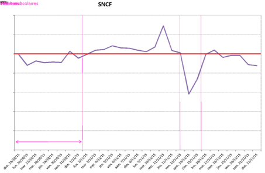
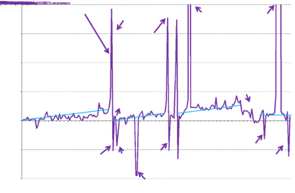

LE POINT SUR...

# L’IMPACT DES ATTENTATS DE NOVEMBRE SUR LA MOBILITÉ DES FRANCILIENS

**Début novembre 2015, les usagers ont rarement autant validé leurs titres de transports sur le réseau ferré Transilien. Du 1er au 13 novembre, soit jusqu’à la veille des attentats, la SNCF observait entre 4% et 8% de validations supplémentaires* au sein de ses gares. Les attentats de novembre 2015 ayant brusquement interrompu cette tendance, la fréquentation des transports en commun sur le réseau Transilien a mis du temps avant de retrouver son niveau de début novembre. Retour sur ces événements et leur impact sur les déplacements des franciliens...**

- L’ensemble des variations du nombre de validations présentes dans cet article sont calculées  par rapport à la période de référence du 18/09/15 au 18/10/15.

## LES FRANCILIENS ONT FAIT LE CHOIX DE RÉDUIRE LEURS DÉPLACEMENTS...

L’ensemble des transports en commun, et sans doute plus particulièrement les réseaux souterrains, ont fortement été impactés par les attentats du 13 novembre. Cette baisse de fréquentation peut, en partie, se mesurer grâce au nombre de validations de titres de transports qui ont été effectuées par les usagers les jours suivants ces événements tragiques. 

*Volumes rapportés à la valeur du volume moyen pour le type de jour concerné hors vacances scolaires (volumes moyens calculés sur la période du 18/9 au 18/10/15)*

*Samedi 14 novembre*
Au lendemain des attentats, les franciliens évitent  les transports en commun. La presse annonce une baisse de 50% des usagers pour la RATP. Les validations télébilletiques SNCF baissent de 42% le samedi.

*Dimanche 15 novembre*
Le nombre de validations remonte légèrement. 

*Lundi 16 novembre*
Les validations SNCF retrouvent leur niveau de référence. La RATP constate une baisse légèrement inférieure à 10% sur son réseau ferré, avec un phénomène plus marqué sur les stations touristiques.

*Mardi 17 novembre*
Le niveau de début novembre est presque atteint. 

*Mercredi 18 novembre*
Suite à l’assaut anti-terroriste de Saint-Denis, le trafic baisse à nouveau de manière significative. Cet état perdurera jusqu’au dimanche suivant.

En novembre et décembre, le comportement des franciliens est resté marqué par les événements. La courbe de fréquentation des transports en commun sur le réseau Transilien a, certes, repris de la vigueur - les attentats n’ont pas gommé la tendance à la hausse que l’on observait depuis l’entrée en vigueur du Navigo Toutes Zones - mais elle est demeurée ralentie, comparée aux élans constatés au début du mois de novembre 2015. 

En janvier 2015, les évènements survenus au siège de Charlie Hebdo n’avaient pas engendré une telle diminution des validations, ni un tel impact dans le temps. Cette différence pourrait s’expliquer par l’ampleur des attentats de novembre (130 morts, contre 17 en janvier), la multiplicité des lieux touchés, le nombre de terroristes impliqués ainsi que les peurs rétroactives suscitées par l’attentat raté du Stade de France. 

Le début de l’année 2016 connaît une forte croissance du nombre de validations. Les craintes post-attentats se sont-elles amoindries ? Les Forfaits Toutes Zones se diffusent-ils davantage ? La mise en place de la régularisation pour non-validation a-t-elle eu un effet marquant ? Les différents effets inhérents aux données de validation rendent compliquée l’interprétation. En effet, presque 9% de l’augmentation des validations découleraient d’une diminution du nombre de gares en travaux en janvier et 7% en février. En effet, il n’était pas possible de valider en 2015 dans certaines gares en travaux. C’est le cas par exemple de Gare du Nord, c’est-à-dire la gare transilienne où le nombre de validations est le plus élevé. La poursuite des analyses par gare permettra d’affiner ces hypothèses.

## ... SURTOUT LES WEEK-ENDS

En septembre et octobre 2015, la hausse du nombre de validations se faisait un peu plus ressentir le week-end qu’en semaine. Après les attentats de novembre, c’est l’exact inverse pour la fin novembre et le mois de décembre. En semaine, tout se passait comme si les franciliens n’avaient pas d’autre choix que de se déplacer (lieu de travail, d’études…), alors qu’ils n’hésitaient pas à freiner leur utilisation des transports en commun le week-end, au détriment de leurs sorties de loisirs. Le phénomène ne semble plus marqué depuis janvier 2016.

Ecart entre le nombre de validations SNCF par jour 2015 et l’équivalent jour 2014

- Note de lecture : Les jours 2015 sont comparés au jour équivalent 2014, en termes de positionnement dans la semaine. Par exemple, le lundi 7 septembre 2015 est comparé au lundi 8 septembre 2014. Les écarts du 10 et du 11 novembre sont donc des effets purement calendaires : le 11 novembre 2014 étant un mardi, l’effet pont a été davantage marqué en 2014 qu’en 2015, lorsque le 11 novembre était un mercredi.
