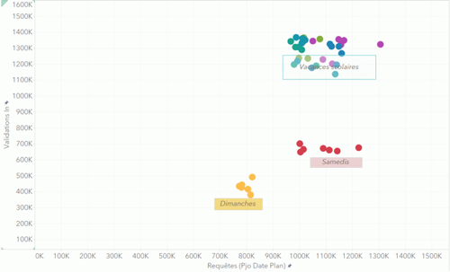
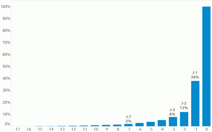
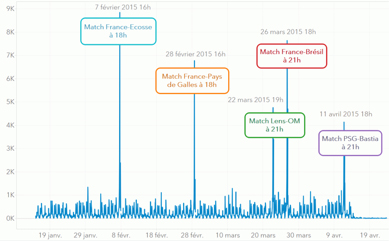

# SNCF TRANSILIEN SE PENCHE SUR LES REQUÊTES D’ITINÉRAIRES POUR MIEUX COMPRENDRE LA MOBILITÉ DES FRANCILIENS

En mars 2016, 45% des pages visitées sur le site Transilien.com concernent la requête d’itinéraires. 
Besoin de recommandations pour planifier un trajet inhabituel et connaître les horaires associés, ou simplement identifier l’itinéraire qui comporte le moins de correspondances ou de marche à pied ? 
SNCF Transilien met à la disposition des voyageurs de nombreuses solutions digitales pour réaliser leurs requêtes d’itinéraires. En collaboration avec les filiales de Kéolis (Kisio Digital, Kisio Analysis), SNCF (Innovation & Recherche, Transilien) a mené des études sur ces dernières pour mieux connaître et anticiper la demande de mobilité multimodale des franciliens.

## QUAND LA REQUÊTE D’ITINÉRAIRE RENSEIGNE SUR LA MOBILITÉ DES FRANCILIENS

**3 mois de données, correspondant à près de 100 millions de requêtes, ont été analysés**. Cet échantillon conséquent permet à Transilien de disposer d’enseignements robustes sur l’utilisation du calcul d’itinéraire et les intentions de déplacement des franciliens.

### UN LIEN DIRECTE ENTRE LES REQUÊTES ET LA MOBILITÉ

Les requêtes d’itinéraires matérialisent en premier lieu des intentions de déplacement, elles donnent également **une indication forte de la fréquentation réelle** du réseau. Ces données sont précieuses car elles permettent aux équipes de SNCF Transilien d’avoir un temps d’avance sur la mobilité des voyageurs.

En confrontant le nombre de requêtes au nombre de validations, on visualise une relation directe. 

A titre d’exemple,  800 000 requêtes réalisées pour un  trajet planifié le dimanche correspondent à 400 000 validations constatées ce même jour.  

## ANTICIPER POUR MIEUX GÉRER LES FOULES

Encore très peu exploitée, la requête d’itinéraire constitue pourtant la seule façon de révéler la façon dont les voyageurs anticipent leurs déplacements.  

Sur l’ensemble des requêtes effectuées pour un trajet :
- Près de 2% sont réalisées 1 semaine avant le départ.
- 8% sont réalisées 3 jours avant le départ
- **Près de 40% sont réalisées la veille du départ**

Cette proportion atteint les 73% pour un trajet planifié le lundi matin entre 07h et 09h.

### DES PHÉNOMÈNES D’ANTICIPATION EXACERBÉS LORS D’ÉVÈNEMENTS

En améliorant l’exploitation des requêtes d’itinéraires, les transporteurs  pourraient mieux appréhender les déplacements des voyageurs dans le cadre notamment d’évènements particuliers (concerts, matchs, salons etc…). **Ces requêtes  permettraient, dans la mesure du possible, d’adapter l’offre de transport ou de définir de nouveaux services de mobilité.**

Sur le graphique ci-dessous, on voit que les pics de requêtes sont observés 2-3 heures avant les matchs du tournoi des 6 nations. L’anticipation est nettement plus précoce pour ce type de voyage puisque 15 à 20% des requêtes sont réalisées 3 jours avant le déplacement planifié vs 6.81% pour des trajets « standards ».

Des **volumes de requête inhabituels** en lien avec des **évènements atypiques** sont ici nettement identifiables

